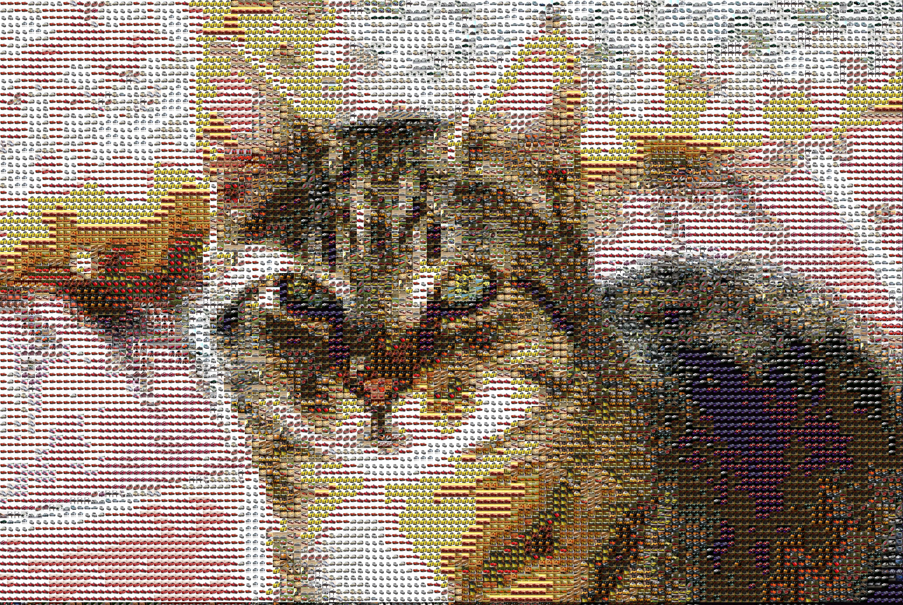

# Tiler: Photo Mosaic Generator

## Overview

`tiler.py` builds a photo‑mosaic: it chops the **source image** into fixed‑size squares, computes each square’s average colour, then replaces it with the closest‑matching **tile image** from a directory you provide. Matching is Euclidean distance in RGB space.

## Requirements

* Python and Pillow

```bash
pip install pillow
```

## Usage

```bash
python tiler.py <SOURCE_IMAGE> <TILE_DIRECTORY> <TILE_SIZE_PX> <OUTPUT_IMAGE> \\
python tiler.py in_cat.jpg cifar10_raw/images/test/Automobile 30 cat.jpg
```

## Example (Car from cats)


